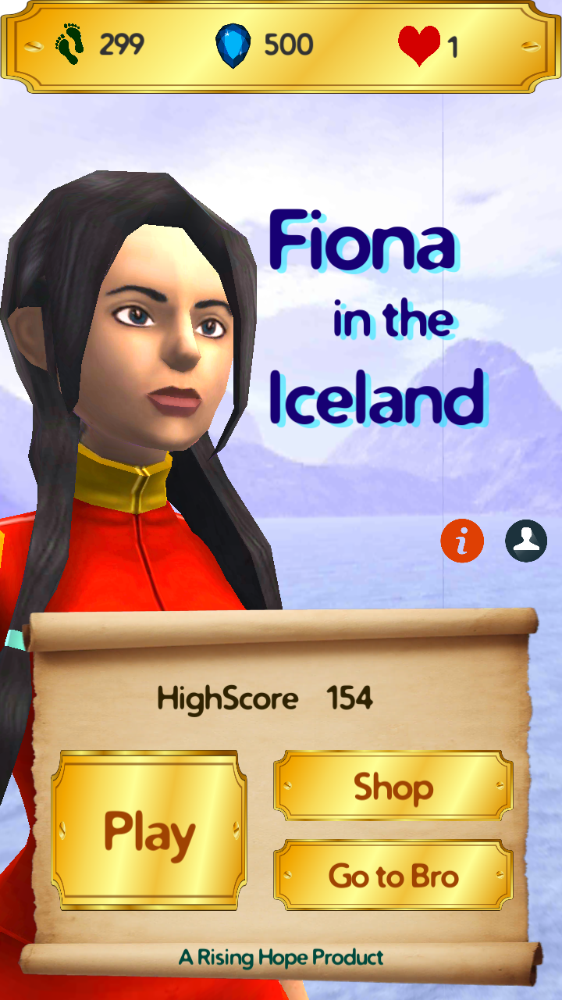
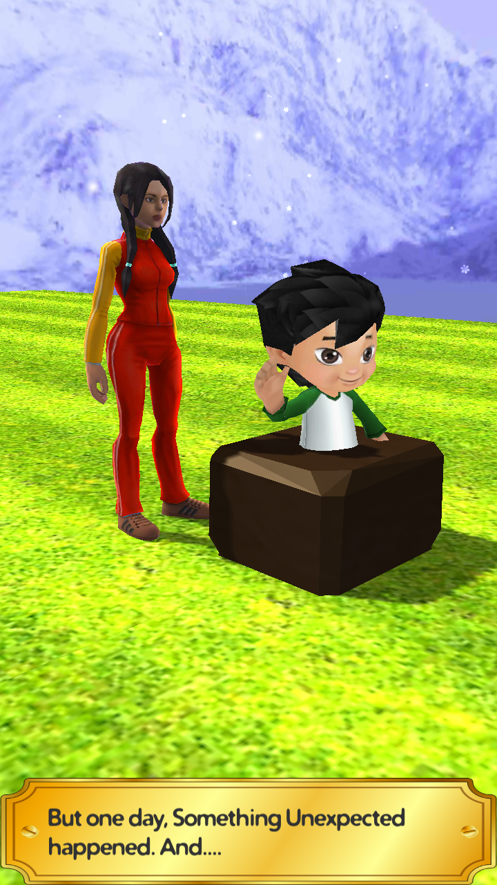
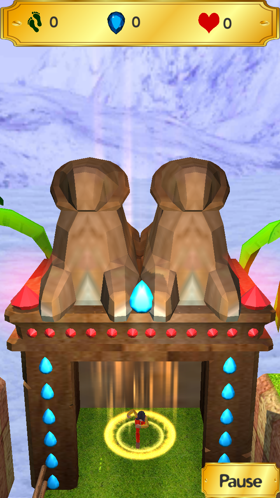
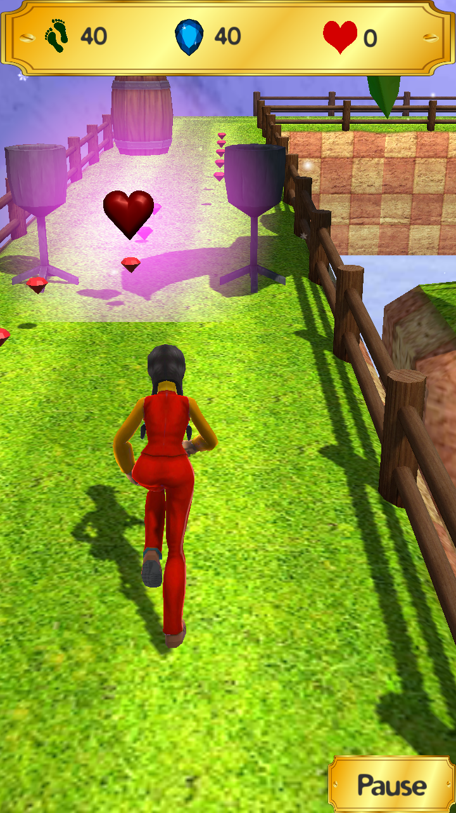
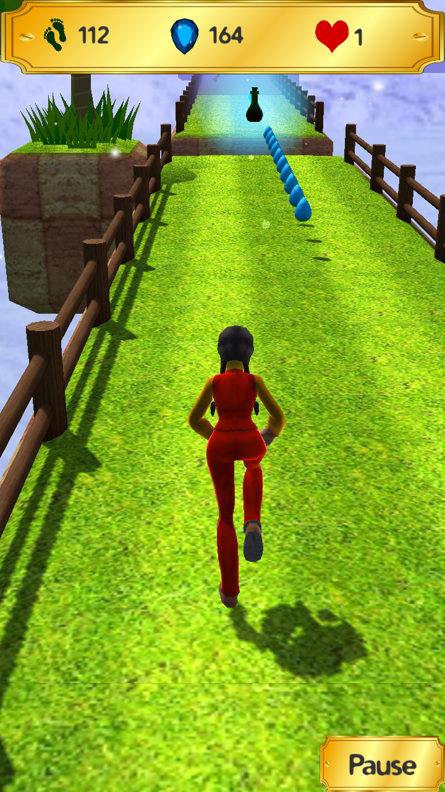
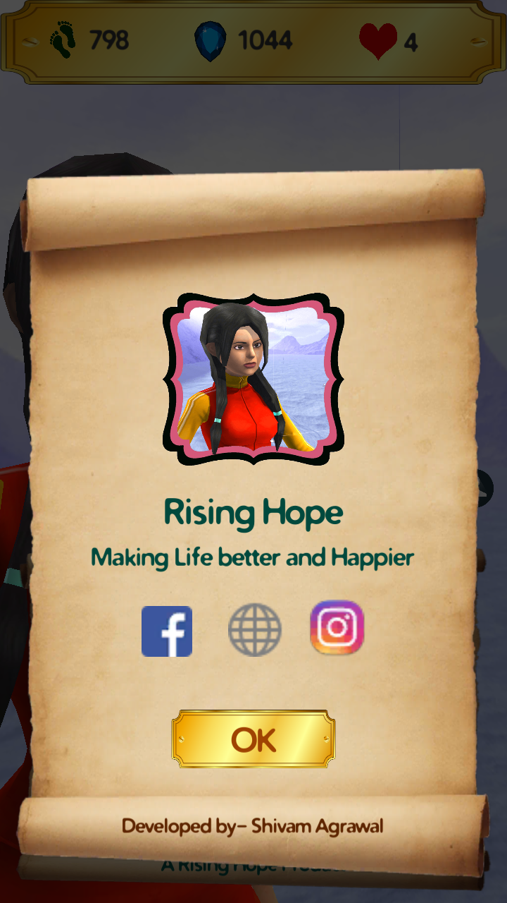

Fiona in the Iceland
======
**Fiona in the Iceland** is a 3D adventure game for Android and Windows, developed in Unity game engine.

#### Screenshot

</img> 
</img> 
</img>
</img>
</img>
</img>

#### App Stores
<!-- edit this image location -->

[</img>](http://risinghopeapps.weebly.com/windows.html)

#### Works on
* Android 4.0.3 (Ice Cream Sandwich) and above
* Windows

### Instruction 

#### For Android
 Project is already configured for Android.

#### For Windows
1. Download zip file or clone repo.
2. Replace this file with this.
3. Open project in Unity
4. Go to File>Built Setting>[Select Windows]>Switch player
6. Done

### Permissions
* Does not require any special permission

### Built With

* [Unity - Game Engine](https://unity3d.com/) - Cross platform game development tool

### Authors

* **Shivam Agrawal** - [Rising Hope](http://risinghopeapps.weebly.com/)

### Version 
* Version 1.0.0

## License 
* see [LICENSE](/LICENSE) file
